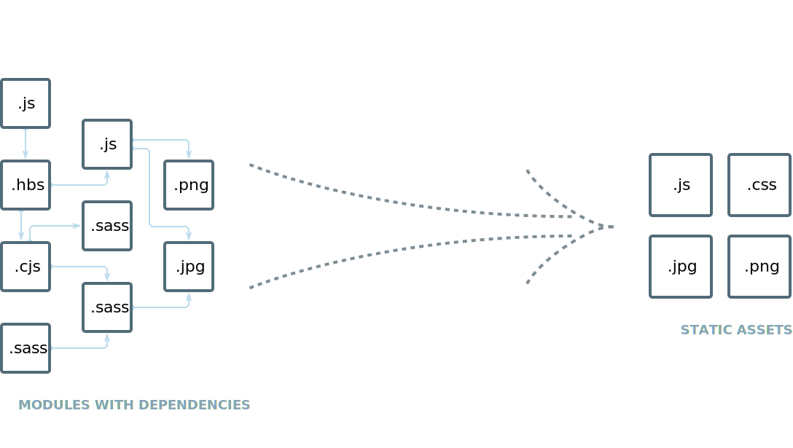

## 介绍



`webpack` 是一个现代 `JavaScript` 应用程序的静态模块打包工具。

webpack 能做什么

- 代码转换
- 文件优化
- 代码分割
- 模块合并
- 自动刷新
- 代码效验
- 自动发布

## 安装

初始化项目

```bash
mkdir webpack-demo & cd webpack-demo
npm init -y
```

全局安装

```bash
yarn add webpack webpack-cli -global

# 全局安装的 webpack 版本号
webpack -v
```

项目中安装（建议使用）

```bash
yarn add webpack webpack-cli --dev

# 项目中安装的 webpack 版本号
npx webpack -v
```
